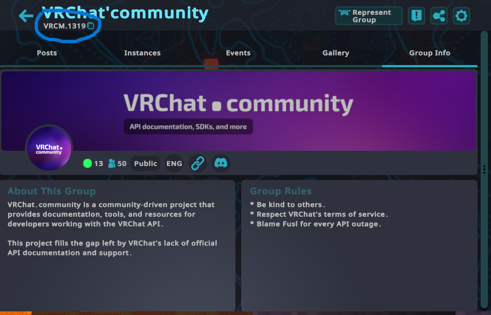
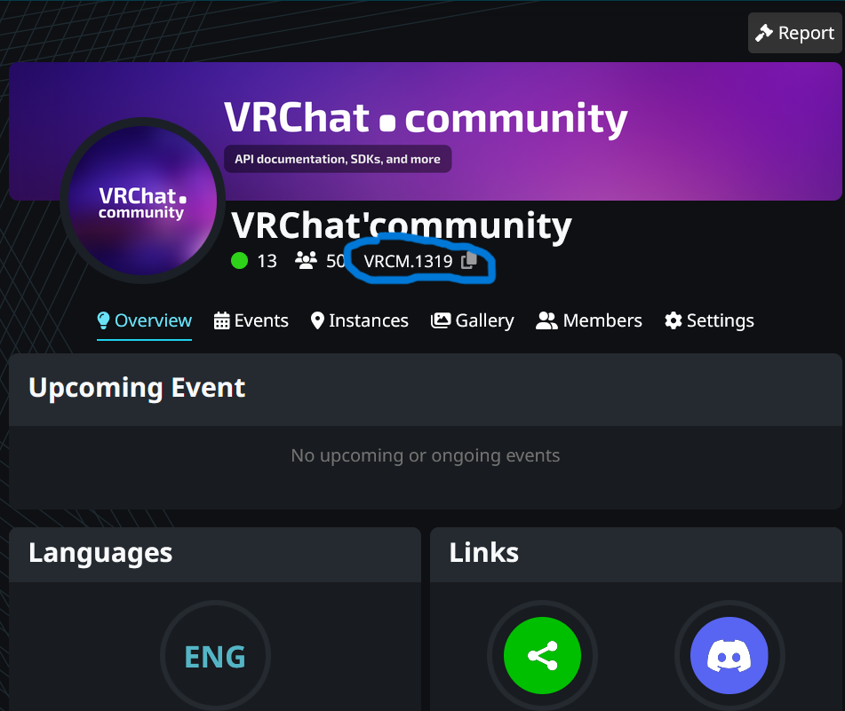

# VRChat Group Assistant

VRChat Group Assistant is an app and backend to help with running a VRChat group, by providing analytics tools for identifying geogrpahical demographics within your group's member base to better understand what times of the day, your group is most active, and other tools for streamlining group moderation, event planning, and more, with possible future features including announcement, moderation, and log syncing with a discord server, if your group has one. See **[Features](docs/Features.md)** for more info.

# Instructions
VRChat Group Assistant, at present not create a config file for you automoatically, which you will need to make manually, following the steps below.

While this will change in future, for now, you will need to start the backend and app individually, from each other.

### Make App Config File
As of version 0.8.0, the basic info VRChat Group Assistant uses to run has been unified under one file in the app backend's main working directory, `config.json`. See example: [config_guide.json](config_guide.json)

To make the config file, create a new file called `config.json` in the main the app's main directory, `VRChatGroupAssistant`, copy and paste over the everything from `config_guide.json`, and replace all the fields in `basicGroupInfo` and `sessionConfig`, except the `cookies` field your account and group information. Make sure your password has been obfuscated before entering it. No other field needs to be changed. 

Alternatively, just replace the necessary info in config_guide.json and remove the `-guide` from the file name. 

### Obfuscating Your Password
To obfuscate your password, temporarily add these lines to `main` or another rust program

```rust
let pw = "YourPasswordHere".to_string();
println!("{}", modules::util::obfuscate_text(&pw));
```
Then run the program and your obfuscated password to the right line in `config_info`.

If you use a different program, make sure to copy and paste the `obfuscate_text()` function definition from the util module to the other program for it to work, and change the call to it, as needed. You can find obfuscate_text()'s definition in [modules/util.rs](src/modules/util.rs).

Also, you can change `obfuscate_text()` obfuscates your password to whatever you want. Just make sure to make the respective changes to `deobfuscate_text()` in the same file, so the program can still pass the right password to VRChat's API.

**Disclaimer**: This obfuscation is not meant to be a secure form of password encryption. It is only there, because I wasn't comfortable with having a VRChat account password in plain text sitting in a file, since I like to screenshare as I develop code, as well as for concerns over potential Windows Recall or similar features.

### Finding Your Group's Basic Info
Your group's short code and discriminator is the group code you can find under your group's name in it's description on VRChat or VRChat's website. It'll look like `ACODE.####`.

**On VRChat**


**On VRChat's Website**


The short code is everything on the left of the `.`, and the discriminator is the numbers.

---
In future, I intend to make it so you can enter your authentication config info and group info through a GUI, and possibly make the password obfuscation more secure.