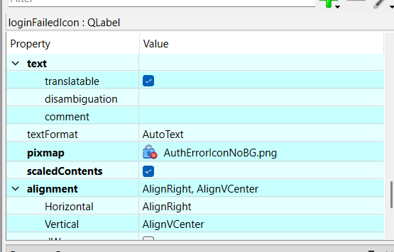
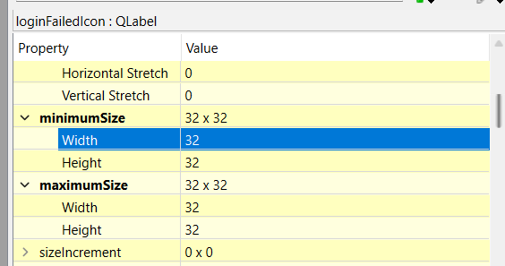

# How to Size a Pixmap in a QLabel

### Problem
When wanting to add an image to a label with Qt, the label will automatically resize to the size of the image, but what if we want the label to be a specific size?

### Solution
In code or in Qt Designer, set the label's `scaledContents` property to true. This will cause the image in the label's `pixmap` property to be automatically resized to fit in the label's bounding box, defined by the label's `minimumSize` and `maximumSize` properties.

### Example in Qt Designer

In this example, `AuthErrorIconNoBG.png` is a 512x512 image, scaled to fit in a 32x32 label.